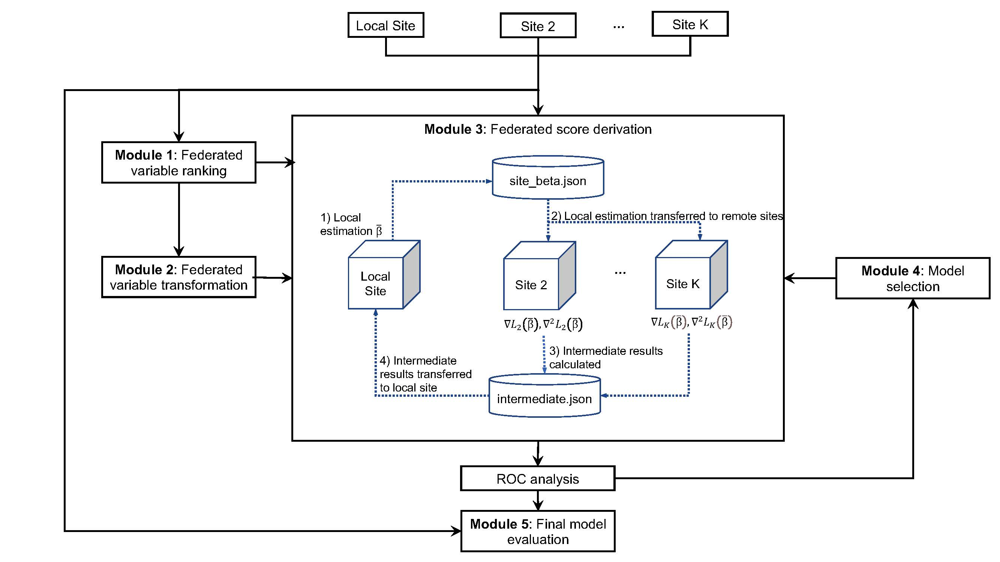

# FedScore: A privacy-preserving framework for federated scoring system development

FedScore is a framework for developing scoring systems across multiple sites in a privacy-preserving way. The R and Python code provided in this repository implements the proposed FedScore algorithm.

## Introduction

Cross-institutional collaboration has gained popularity in recent years as a way to accelerate medical research and facilitate quality improvement. Federated learning (FL) can avoid data sharing by collectively training algorithms without exchanging patient-level data. However, most FL applications in medical image data use black box models from computer vision. Interpretable models, on the contrary, have fewer instances of FL applications despite their popularity in clinical research.

As a type of interpretable risk scoring model, scoring systems have been employed in practically every diagnostic area of medicine. However, scoring systems have usually been created using single-source data, limiting application at other sites if the development data has insufficient sample size or is not representative. Although it is possible to develop scoring systems on pooled data, the process of doing such pooling is time-consuming and difficult to achieve due to privacy restrictions. 

To fill this gap, we propose FedScore, a first-of-its-kind framework for building federated scoring systems across multiple sites. The figure below provides a high-level overview of the FedScore algorithm:

## Usage

### System requirements

To run the R and Python code, you will need:

- R packages: 'AutoScore', 'tidyverse', 'ggplot2', 'mle.tools', 'rjson'
- Python packages: 'sys'

### Running the demo

To run the demo, follow the step-by-step instructions provided in `demo.R`. For demonstration purposes, a sample dataset obtained from the Medical Information Mart for Intensive Care ([MIMIC-IV](https://physionet.org/content/mimiciv/1.0/) and [MIMIC-IV-ED](https://physionet.org/content/mimic-iv-ed/1.0/)) is used. See data pre-processing details at https://github.com/nliulab/mimic4ed-benchmark.

## Citation

Li, S., Ning, Y., Ong, M. E. H., Chakraborty, B., Hong, C., Xie, F., ... & Liu, N. (2023). FedScore: A privacy-preserving framework for federated scoring system development. arXiv preprint arXiv:2303.00282.

## Contact

- Siqi Li(Email: <siqili@u.duke.nus.edu>)
- Nan Liu (Email: <liu.nan@duke-nus.edu.sg>)
